# RPG Battle ユースケース図

このドキュメントは、rpg_battleプロジェクトのユースケース図です。システムの主要な機能とアクター（ユーザー）の関係を示します。

## 評価・修正履歴

### 評価結果
実装コード（APIエンドポイント、ルーター設定、クライアント側ページ）と照らし合わせて評価を行い、以下の修正を実施しました。

### 主な修正内容（第1回）

1. **追加したユースケース**:
   - UC4: セッション確認（プレイヤー用）
   - UC7: 管理者セッション確認
   - UC8: マスタデータ取得（認証不要）
   - UC14: 戦闘状態の取得

2. **修正したユースケース**:
   - UC15 → UC19: 「次の階層へ進む」→「次の戦闘へ進む」（より正確な表現）
   - UC16 → UC20: ゲーム終了の説明を修正（ログアウトを含むことを明記）
   - UC17 → UC21: ゲームオーバー処理の説明を修正（ログアウトしないことを明記）

3. **依存関係の修正**:
   - 実際のAPI呼び出しフローに合わせて依存関係を更新
   - 戦闘開始→戦闘行動→戦闘結果適用→次の戦闘の流れを明確化

4. **注意事項の追加**:
   - ゲーム終了とゲームオーバーの違いを明記
   - マスタデータ取得が認証不要であることを明記

### 主な修正内容（第2回）

1. **ユースケース説明の拡張**:
   - UC9: 「続きから」機能の説明を追加
   - UC11: 「初めから」機能の説明を追加
   - UC12: キャラ再選択機能の説明を追加
   - UC22: 戦績保存がUC20/UC21の一部として実行されることを明記

2. **依存関係の追加**:
   - UC19 → UC13: 次の戦闘へ進むには新しい戦闘開始が必要
   - UC20 → UC10: ゲーム終了にはゲーム状態の保存が必要

3. **注意事項の追加**:
   - 「続きから」と「初めから」の違いを明記

## ユースケース図（Mermaid形式）

```mermaid
graph TB
    subgraph "アクター"
        Player[プレイヤー]
        Admin[管理者]
    end

    subgraph "認証・アカウント管理"
        UC1[ユーザー登録]
        UC2[ログイン]
        UC3[ログアウト]
        UC4[セッション確認]
        UC5[管理者ログイン]
        UC6[管理者ログアウト]
        UC7[管理者セッション確認]
    end

    subgraph "ゲームプレイ"
        UC8[マスタデータ取得]
        UC9[ゲーム状態の取得]
        UC10[ゲーム状態の保存]
        UC11[ゲーム状態のリセット]
        UC12[パーティ編成]
        UC13[戦闘開始]
        UC14[戦闘状態の取得]
        UC15[戦闘行動実行]
        UC16[戦闘結果の適用]
        UC17[経験値の割り振り]
        UC18[アイテム使用]
        UC19[次の戦闘へ進む]
        UC20[ゲーム終了]
        UC21[ゲームオーバー処理]
    end

    subgraph "戦績・ランキング"
        UC22[戦績の保存]
        UC23[戦績の閲覧]
        UC24[ランキング閲覧]
        UC25[戦績詳細の閲覧]
    end

    subgraph "管理者機能 - マスタデータ管理"
        UC26[キャラクターマスタ一覧取得]
        UC27[キャラクターマスタ作成]
        UC28[キャラクターマスタ更新]
        UC29[キャラクターマスタ削除]
        UC30[キャラクター画像アップロード]
        UC31[スキルマスタCRUD]
        UC32[アイテムマスタCRUD]
        UC33[状態異常マスタCRUD]
        UC34[敵マスタCRUD]
        UC35[敵画像アップロード]
    end

    %% プレイヤーのユースケース
    Player --> UC1
    Player --> UC2
    Player --> UC3
    Player --> UC4
    Player --> UC8
    Player --> UC9
    Player --> UC10
    Player --> UC11
    Player --> UC12
    Player --> UC13
    Player --> UC14
    Player --> UC15
    Player --> UC16
    Player --> UC17
    Player --> UC18
    Player --> UC19
    Player --> UC20
    Player --> UC21
    Player --> UC22
    Player --> UC23
    Player --> UC24
    Player --> UC25

    %% 管理者のユースケース
    Admin --> UC5
    Admin --> UC6
    Admin --> UC7
    Admin --> UC26
    Admin --> UC27
    Admin --> UC28
    Admin --> UC29
    Admin --> UC30
    Admin --> UC31
    Admin --> UC32
    Admin --> UC33
    Admin --> UC34
    Admin --> UC35

    %% 依存関係（include/extend）
    UC13 -.->|include| UC9
    UC15 -.->|include| UC13
    UC16 -.->|include| UC15
    UC19 -.->|include| UC16
    UC19 -.->|include| UC13
    UC20 -.->|include| UC22
    UC20 -.->|include| UC10
    UC21 -.->|include| UC22
    UC21 -.->|include| UC11
    UC17 -.->|include| UC16
    UC18 -.->|include| UC9
```

## ユースケース詳細説明

### アクター

#### プレイヤー（Player）
- ゲームをプレイする一般ユーザー
- ログイン、戦闘、レベルアップ、戦績閲覧などの機能を使用

#### 管理者（Admin）
- マスタデータを管理する管理者ユーザー
- キャラクター、スキル、敵、アイテム、状態異常のマスタデータを編集

---

### 認証・アカウント管理

#### UC1: ユーザー登録
- **説明**: 新規ユーザーアカウントを作成
- **前提条件**: なし
- **主な流れ**:
  1. ユーザー名とパスワードを入力
  2. システムが重複チェック
  3. アカウント作成と初期状態の生成
  4. 自動ログイン

#### UC2: ログイン
- **説明**: 既存ユーザーとしてログイン
- **前提条件**: 登録済みアカウントが存在
- **主な流れ**:
  1. ユーザー名とパスワードを入力
  2. 認証成功後、セッション開始
  3. スタート画面へ遷移

#### UC3: ログアウト
- **説明**: セッションを終了
- **前提条件**: ログイン済み
- **主な流れ**:
  1. ログアウトボタンをクリック
  2. セッション破棄
  3. ログイン画面へ遷移

#### UC4: セッション確認
- **説明**: 現在のセッション状態を確認
- **前提条件**: なし
- **主な流れ**:
  1. セッション状態を確認
  2. ログイン済みの場合はユーザー情報を返す

#### UC5: 管理者ログイン
- **説明**: 管理者としてログイン
- **前提条件**: 管理者アカウントが存在
- **主な流れ**:
  1. 管理者ユーザー名とパスワードを入力
  2. 認証成功後、管理者セッション開始
  3. 管理者画面へ遷移

#### UC6: 管理者ログアウト
- **説明**: 管理者セッションを終了
- **前提条件**: 管理者としてログイン済み

#### UC7: 管理者セッション確認
- **説明**: 現在の管理者セッション状態を確認
- **前提条件**: なし
- **主な流れ**:
  1. セッション状態を確認
  2. ログイン済みの場合はユーザー名を返す

---

### ゲームプレイ

#### UC8: マスタデータ取得
- **説明**: ゲームに必要なマスタデータ（キャラクター、スキル、敵、アイテム、状態異常）を取得
- **前提条件**: なし（認証不要）
- **主な流れ**:
  1. マスタデータ取得APIを呼び出し
  2. キャッシュから最新のマスタデータを取得
  3. クライアント側で使用

#### UC9: ゲーム状態の取得
- **説明**: ユーザーの現在のゲーム状態を取得
- **前提条件**: ログイン済み
- **主な流れ**:
  1. サーバーから状態データを取得
  2. 現在の階層、キャラクター情報、経験値ストックなどを取得
  3. 「続きから」選択時は、取得した状態をそのまま使用してゲームを再開

#### UC10: ゲーム状態の保存
- **説明**: 現在のゲーム状態をデータベースに保存
- **前提条件**: ログイン済み
- **主な流れ**:
  1. 現在の階層と状態データを送信
  2. データベースに保存

#### UC11: ゲーム状態のリセット
- **説明**: ゲーム状態を初期状態にリセット（「初めから」選択時）
- **前提条件**: ログイン済み
- **主な流れ**:
  1. スタート画面で「初めから」を選択
  2. リセット要求を送信
  3. 初期状態を生成して保存
  4. パーティ選択画面へ遷移

#### UC12: パーティ編成
- **説明**: 戦闘に参加するキャラクターを選択（初回編成または再編成）
- **前提条件**: ログイン済み、ゲーム状態が存在
- **主な流れ**:
  1. パーティ選択画面で3人のキャラクターを選択
  2. 決定ボタンをクリック
  3. 戦闘画面へ遷移
- **備考**: メニュー画面から「キャラ再選択」を選択した場合も同じ機能を使用

#### UC13: 戦闘開始
- **説明**: 新しい戦闘を開始
- **前提条件**: ログイン済み、パーティが編成済み
- **主な流れ**:
  1. 現在の階層とパーティ情報を送信
  2. サーバーが敵を生成
  3. 戦闘状態を初期化
  4. 戦闘画面を表示

#### UC14: 戦闘状態の取得
- **説明**: 現在進行中の戦闘状態を取得
- **前提条件**: 戦闘中
- **主な流れ**:
  1. 戦闘IDを指定して戦闘状態を取得
  2. パーティ、敵、ターン順序、ログなどの情報を取得

#### UC15: 戦闘行動実行
- **説明**: キャラクターの行動を実行（攻撃、スキル、アイテム、防御）
- **前提条件**: 戦闘中、自分のターン
- **主な流れ**:
  1. 行動コマンドを選択（攻撃/スキル/アイテム/防御）
  2. ターゲットを選択（必要に応じて）
  3. サーバーに行動を送信
  4. サーバーが行動を処理し、結果を返す
  5. 敵のターンが自動実行される

#### UC16: 戦闘結果の適用
- **説明**: 戦闘終了後の結果をゲーム状態に適用
- **前提条件**: 戦闘終了
- **主な流れ**:
  1. 戦闘結果（勝利/敗北）を取得
  2. 獲得経験値を経験値ストックに加算
  3. キャラクターのHP/MPを更新
  4. ゲーム状態を更新

#### UC17: 経験値の割り振り
- **説明**: 経験値ストックからキャラクターやスキルに経験値を割り振る
- **前提条件**: ログイン済み、経験値ストックが存在
- **主な流れ**:
  1. レベルアップ画面で割り振り先を選択
  2. 割り振る経験値を入力
  3. サーバーに送信
  4. レベルアップ判定とスキル習得判定
  5. 状態を更新

#### UC18: アイテム使用
- **説明**: 所持アイテムを使用してキャラクターを回復
- **前提条件**: ログイン済み、アイテムを所持
- **主な流れ**:
  1. メニュー画面でアイテムを選択
  2. 使用対象のキャラクターを選択
  3. アイテム効果を適用（HP/MP回復など）
  4. アイテム在庫を減らす

#### UC19: 次の戦闘へ進む
- **説明**: 現在の階層をクリアし、次の階層の戦闘を開始
- **前提条件**: 戦闘勝利、戦闘結果適用済み
- **主な流れ**:
  1. 「次の戦闘」ボタンをクリック
  2. 現在の階層を+1
  3. 新しい戦闘を開始（UC13を実行）

#### UC20: ゲーム終了
- **説明**: ゲームを終了し、戦績を保存してログアウト
- **前提条件**: ログイン済み
- **主な流れ**:
  1. メニューから「ゲーム終了」を選択
  2. 現在の戦績を保存（ended_reason=quit）
  3. ゲーム状態を保存
  4. セッションを破棄してログアウト

#### UC21: ゲームオーバー処理
- **説明**: 全滅時の処理（戦績保存と状態リセット）
- **前提条件**: 戦闘中に全滅
- **主な流れ**:
  1. 全滅を検出
  2. 戦績を保存（ended_reason=game_over）
  3. ゲーム状態を初期化
  4. スタート画面へ遷移（ログイン状態は維持）

---

### 戦績・ランキング

#### UC22: 戦績の保存
- **説明**: ゲーム終了時や全滅時に戦績を保存
- **前提条件**: ゲーム終了または全滅
- **主な流れ**:
  1. 最大到達階層、最大ダメージ、キャラクターレベル、スキルレベルなどを記録
  2. データベースに保存
- **備考**: 通常はUC20（ゲーム終了）またはUC21（ゲームオーバー処理）の一部として実行される

#### UC23: 戦績の閲覧
- **説明**: 自分の過去の戦績一覧を閲覧
- **前提条件**: ログイン済み
- **主な流れ**:
  1. 戦績画面を開く
  2. 過去の戦績一覧を表示
  3. 詳細をクリックして詳細画面へ

#### UC24: ランキング閲覧
- **説明**: 全ユーザーのランキングを閲覧
- **前提条件**: なし（認証不要）
- **主な流れ**:
  1. ランキング画面を開く
  2. 最大到達階層や最大ダメージでソートされたランキングを表示

#### UC25: 戦績詳細の閲覧
- **説明**: 特定の戦績の詳細情報を閲覧
- **前提条件**: ログイン済み
- **主な流れ**:
  1. 戦績一覧から詳細を選択
  2. キャラクターレベル、スキルレベル、所持アイテムなどの詳細を表示

---

### 管理者機能 - マスタデータ管理

#### UC26-UC30: キャラクターマスタ管理
- **説明**: キャラクターのマスタデータを管理（一覧取得、作成、更新、削除、画像アップロード）
- **前提条件**: 管理者としてログイン済み
- **主な流れ**:
  1. 管理者画面でキャラクター管理を選択
  2. 一覧表示、新規作成、編集、削除、画像アップロードを実行
  3. 変更後、マスタキャッシュを再読み込み

#### UC31: スキルマスタCRUD
- **説明**: スキルのマスタデータを管理（作成、読み取り、更新、削除）
- **前提条件**: 管理者としてログイン済み

#### UC32: アイテムマスタCRUD
- **説明**: アイテムのマスタデータを管理
- **前提条件**: 管理者としてログイン済み

#### UC33: 状態異常マスタCRUD
- **説明**: 状態異常のマスタデータを管理
- **前提条件**: 管理者としてログイン済み

#### UC34-UC35: 敵マスタ管理
- **説明**: 敵のマスタデータを管理（CRUD + 画像アップロード）
- **前提条件**: 管理者としてログイン済み

---

## ユースケース間の関係

### Include（含む）関係
- **UC13 → UC9**: 戦闘開始にはゲーム状態の取得が必要
- **UC15 → UC13**: 戦闘行動実行には戦闘開始が必要
- **UC16 → UC15**: 戦闘結果の適用には戦闘行動実行が必要
- **UC19 → UC16**: 次の戦闘へ進むには戦闘結果の適用が必要
- **UC19 → UC13**: 次の戦闘へ進むには新しい戦闘の開始が必要
- **UC20 → UC22**: ゲーム終了には戦績の保存が必要
- **UC20 → UC10**: ゲーム終了にはゲーム状態の保存が必要
- **UC21 → UC22**: ゲームオーバー処理には戦績保存が必要
- **UC21 → UC11**: ゲームオーバー処理には状態リセットが必要
- **UC17 → UC16**: 経験値の割り振りには戦闘結果の適用が必要
- **UC18 → UC9**: アイテム使用にはゲーム状態の取得が必要

### Extend（拡張）関係
- 現在、明示的な拡張関係は定義していませんが、将来的に追加可能です

---

## システム境界

### システム内
- すべてのユースケースは `rpg_battle` システム内で実行されます
- データベース、マスタデータ、戦闘ロジック、認証システムなどが含まれます

### システム外
- ブラウザ（クライアント）
- MySQL/MariaDB（データベースサーバー）
- ファイルシステム（画像保存）

---

## 注意事項

- **認証**: すべてのゲームプレイ関連ユースケースはログインが前提条件です（マスタデータ取得とランキング閲覧は除く）
- **管理者機能**: 管理者機能は管理者ログインが必須です
- **戦闘状態**: 戦闘状態はサーバーメモリ上のみで保持され、リロード復帰はできません
- **データ保存**: ゲーム状態は戦闘終了時やゲーム終了時にのみ保存されます
- **ランキング**: ランキング閲覧は認証不要で誰でも閲覧可能です
- **マスタデータ**: マスタデータ取得は認証不要で、キャッシュから最新データを取得します
- **ゲーム終了とゲームオーバーの違い**:
  - **ゲーム終了（UC20）**: メニューから手動で終了。戦績保存→状態保存→ログアウト
  - **ゲームオーバー（UC21）**: 全滅による自動終了。戦績保存→状態リセット→ログイン維持
- **ゲーム再開**:
  - **続きから**: スタート画面で「続きから」を選択すると、UC9（ゲーム状態の取得）で取得した状態をそのまま使用してゲームを再開
  - **初めから**: スタート画面で「初めから」を選択すると、UC11（ゲーム状態のリセット）を実行して新規ゲームを開始

